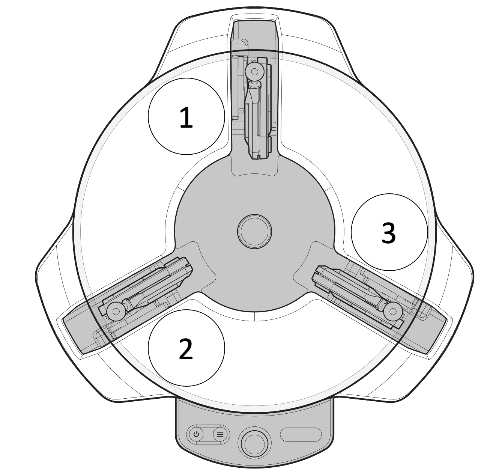
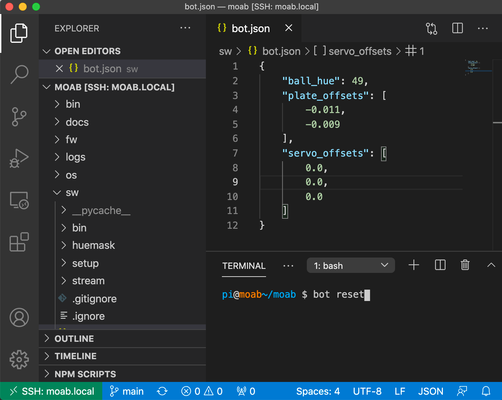

# Moab Calibraiton

Moab calibration consists of 3 components:

- Ball Hue: This is the color hue used by OpenCV to detect the ball. The default calibration is for the orange ball but the hue can change based on the lighting. If your Moab is having difficulty balancing the ball, try recalibrating to ensure proper ball detection.

- Ball Position: Each Moab is slightly different due to tolerances in the parts so this calibration determines the X and Y offsets to the center of the ball on the plate.

- Servo Offset: These are the servo offsets that determine a level plate. Since there are three servos, there are three offset values.

## Ball Hue and Position Calibration

These calibration values are updated in one step. It is important to perform this step as soon as you setup your Moab or if you move it to a new location since it is affected by the lighting.

1. In the menu, navigate to and select CALIBRATION. Follow the prompts on the Moab screen. If calibration is successful, the Ball Hue value will be displayed.

You can always view the hue value on your Moab by navigating to and selecting HUE INFO.

## Servo Offset (plate level) calibration

The servo offset calibration is a bit more advanced and is only necessary to do if your Moab is having trouble balancing the ball or the plate visibly needs to be leveled. It is important to complete the Ball Hue and Position calibration step before following this procedure. [Connecting](https://github.com/microsoft/moabian/blob/docs-v3-updates/docs/connecting.md) to your Moab is a prerequisite to this procedure.

1. To check the level of the plate, navigate to and select JOYSTICK. Place the ball on the center of the plate and observe where it rolls off the plate. If the ball does not roll, but stays in place, your plate is level and you do not need to complete this calibration.

2. SSH into Moab (see instructions in previous section)

3. Navigate to the moab/sw folder (cd moab/sw) and open the bot.json file using your favorite file editor. The three servo offsets in this file correspond to the three servos as shown in the diagram. 

4. Update the servo offset values based on where the ball rolls off the plate. Add a negative integer value (start off with -1.0) corresponding to the servo that was closest to the ball when it rolled off the plate. Save the bot.json file.

5. Restart the Moab software using the command **bot reset** in the command line.

6. Check the level of the plate using JOYSTICK mode.

7. Repeat steps 4 through 6 until the plate is level.

You can always view the servo offset values on your Moab by navigating to and selecting HUE INFO.
