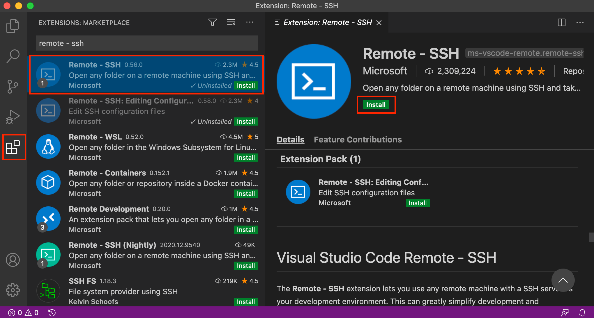
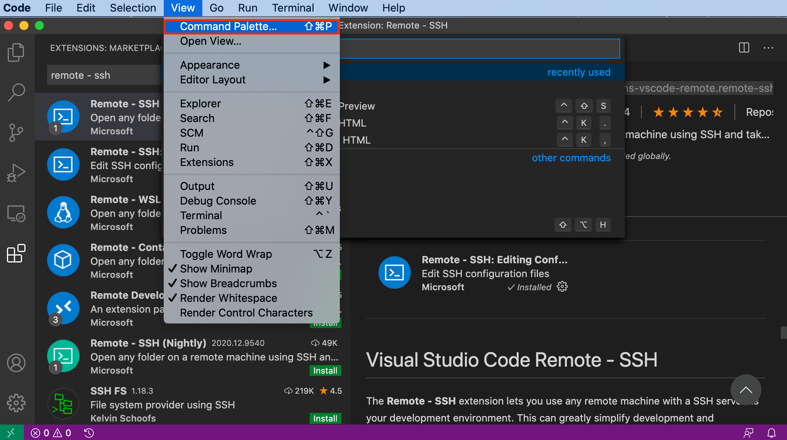
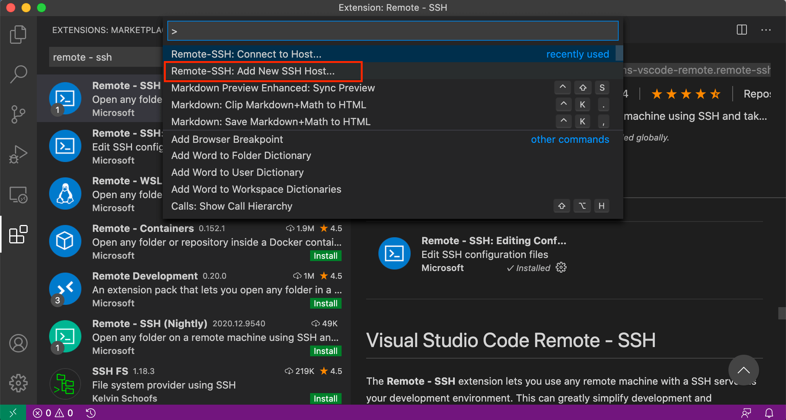
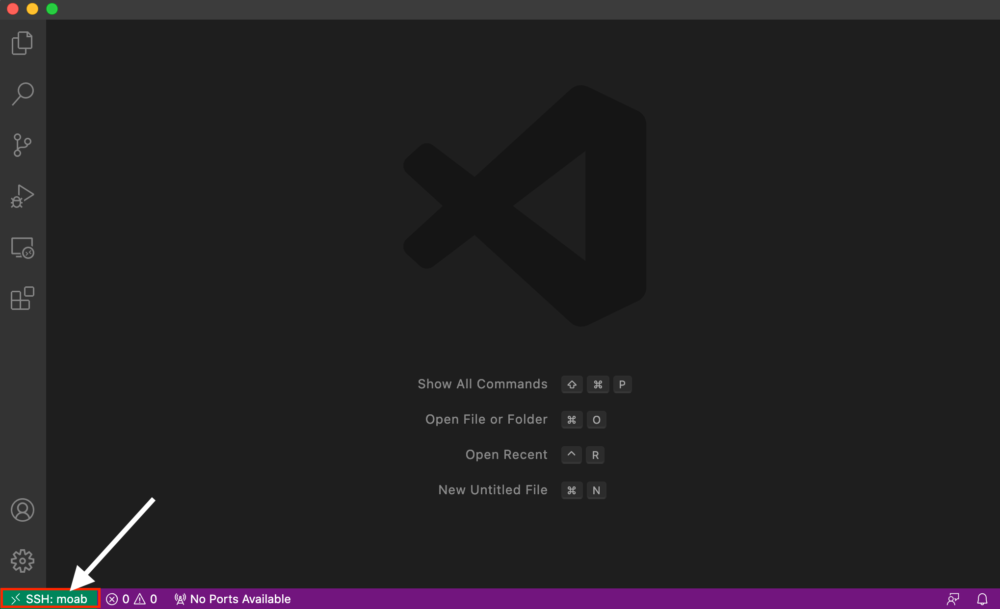

# Connecting to Moab

To deploy your own brain on Moab, you will need to connect to it on your
local network. For the initial setup, we recommend using an ethernet
cable to connect your Moab to your local network. If you are unable to
connect to your network with an ethernet cable you can do so using WiFi.
To configure the WiFi on your Moab, you will need an HDMI monitor and
USB keyboard.

## Option 1: Connecting with an ethernet cable

### Required Materials

- Ethernet cable (to connect Moab to your local network)

Connect one end of an ethernet cable to your Moab and the other end to
your router.

## Option 2: Connecting with an HDMI monitor and USB keyboard

### Required Materials

- HDMI Monitor
- USB Keyboard

1. Connect Moab to a monitor using an HDMI cable.

2. Connect Moab to a USB keyboard.

3. When prompted for the moab login, use "pi" and "raspberry":

    login: pi
    password: raspberry

4. Follow the instructions in the next section to enable the WiFi.

## Enable WiFi (required for Option 2)

1. Type `sudo raspi-config`, and hit enter to open the Raspberry Pi
Software Configuration Tool.

    >sudo raspi-config

2. If prompted, select your country from the list. You can type the
first letter of your country as a short cut.

3. Select **2 Network Options**.

4. Select **N2 Wireless LAN**.

5. Enter your WiFi network name.

6. Enter your WiFi password.

7. Select **Finish**.

## SSH into Moab

There are multiple methods to SSH into Moab. We provide instructions for
using Visual Studio Code.

#### SSH into Moab using Visual Studio Code

1. Open Visual Studio Code. If you don't have it you can download it for
free [here](https://code.visualstudio.com/).

2. Add the extension **Remote - SSH**, if you don't already have it.
Click on the Extensions icon on the left, and search "Remote - ssh" as
shown in the following example. Click **Install**.

   

3. Add a new SSH host. Open the Command Palette through the **View**
menu as shown in the following screenshot:

    

    Search for the command **Remote-SSH: Add New SSH Host...** as shown
    in the following screenshot:

    

    Follow the prompts to create or update an SSH configuration file and
    add a new SSH Host. 

    Use the user and host/IP `pi@moab.local` when prompted:

    >pi@moab.local

    Use the password `raspberry` when prompted.

    >raspberry

4. Connect to SSH Host. Search for and select the command **Remote-SSH:
Connect to Host...**. Follow the prompts. When you have successfully
connected, you will will see "**SSH: moab.local**" in the bottom left
corner of the VS Code window as shown in the following screenshot:

    
