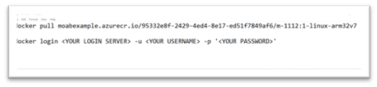
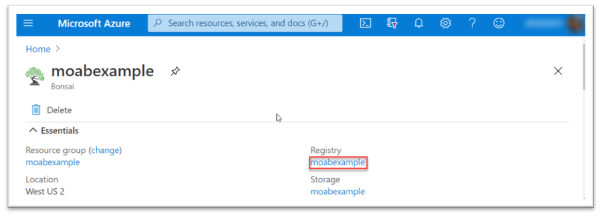
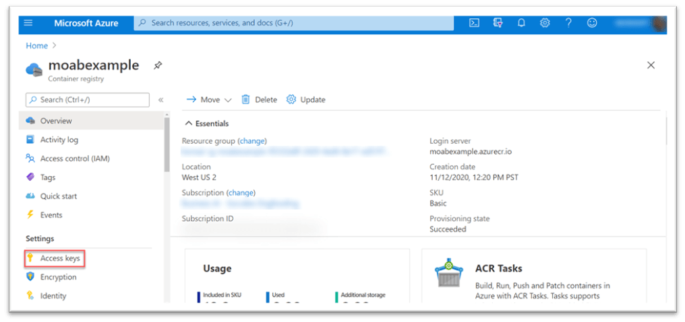
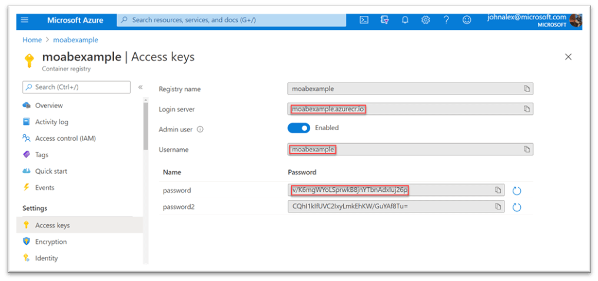
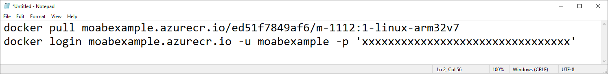
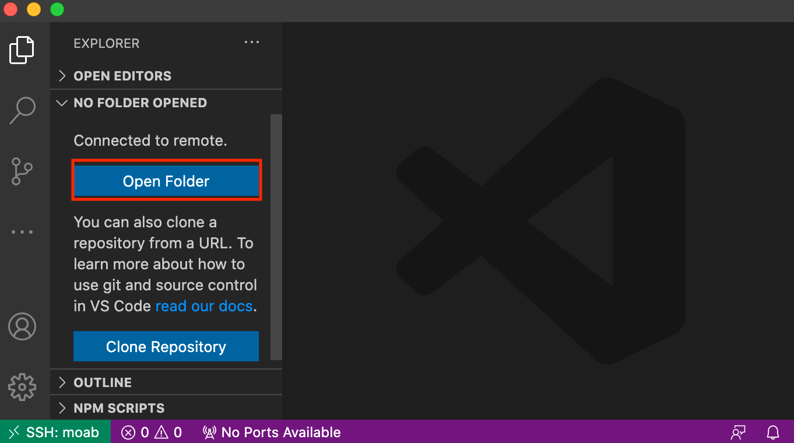
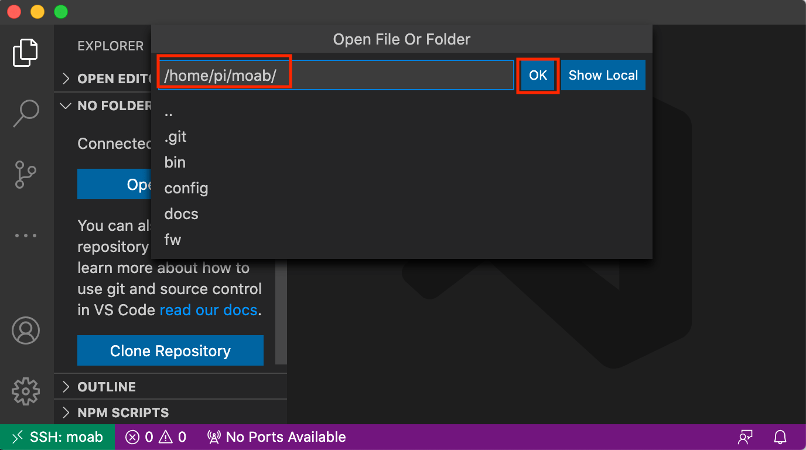
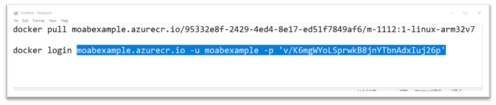
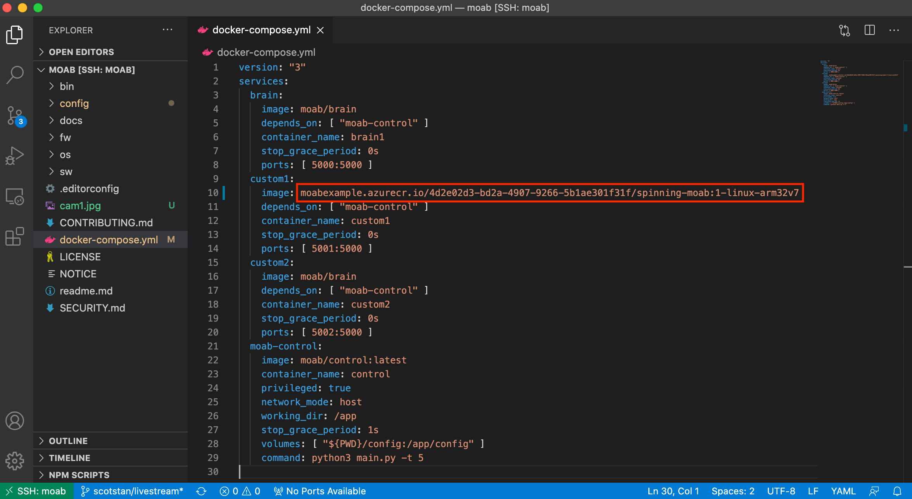

# Deploy a Brain on Moab

### Retrieve ACR credentials

1. Copy/paste the following docker login statement into your text
editor: *(You’ll paste your credentials from your Container Registry
into it during later steps)*

    > `docker login <YOUR LOGIN SERVER> -u <YOUR USERNAME> -p '<YOUR
    > PASSWORD>' `

    

2. Login to [https://portal.azure.com](https://portal.azure.com)

3. Go to your **Bonsai workspace**

4. Click on **Registry** in upper right corner to go to the **Container
Registry** page, as in the following screenshot:  

   

5. On the **Container Registry** page, in the **Settings** section
(left-hand menu), click the **Access Keys** page link, as in the
following screenshot:

   

6. In the **Access Keys** page, copy/paste the **Login server** name,
**Username**, and **Password** into a text editor, as in the following
screenshot:

   

7. In your text editor, replace the `<values>` in the docker login
statement using the fields you copied (keep the single quotes around
password), as in the following example:

   

### Login to ACR from Moab

1. Open Visual Studio Code. If you have not yet already, SSH into Moab
following the previous instructions.

2. Open a new terminal window. You can do this by selecting "**New
Terminal**" from the terminal window as shown in the screenshot below:

    

3.	Copy/Paste or type the previously completed **docker login**
statement in to the terminal and hit enter. 

3. Type `cd moab`, and hit enter, to go to the moab directory.

4. Paste the **docker pull** command from your text editor and hit
enter.

5. After the docker pull completes, type `docker images` and hit the
enter to see the exported brain image in the list.

### Edit the docker-compose.yml file

2. Select"**Open Folder**" as shown in the following screenshot.
Alternatively, you can select **File** --> **Open**

    

    Select **moab** from the dropdown or type the file path
    `/home/pi/moab/` and select **OK**.

    

1. Open the **docker-compose.yml** file by selecting in from the menu on
the left.

4. At line 10, delete `moab/brain` and copy/paste the container name of
your exported brain (everything after the words `docker pull`) from the
text editor, as in the following screenshots: 

   

    

### Restart your Moab and test your deployed brain

1. In the terminal, type `down` and hit enter to terminate the Moab
control service.

2. Type `up` and hit enter to restart the Moab control service.

3. Test your new exported brain on your Moab hardware by selecting
“**Custom 1**” on your Moab menu (don’t forget your ping pong ball!).
