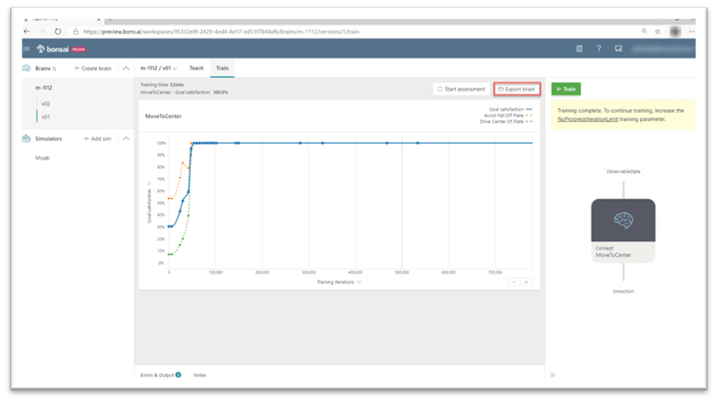
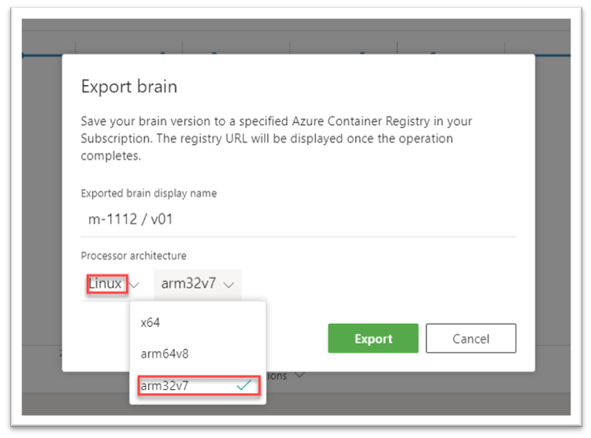
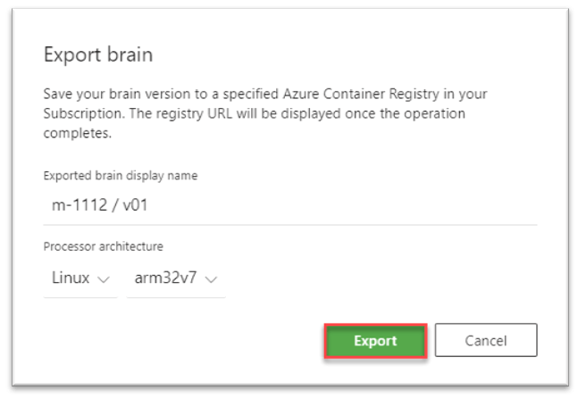
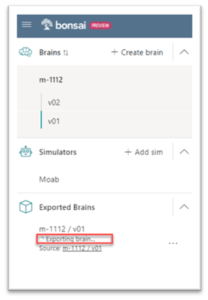
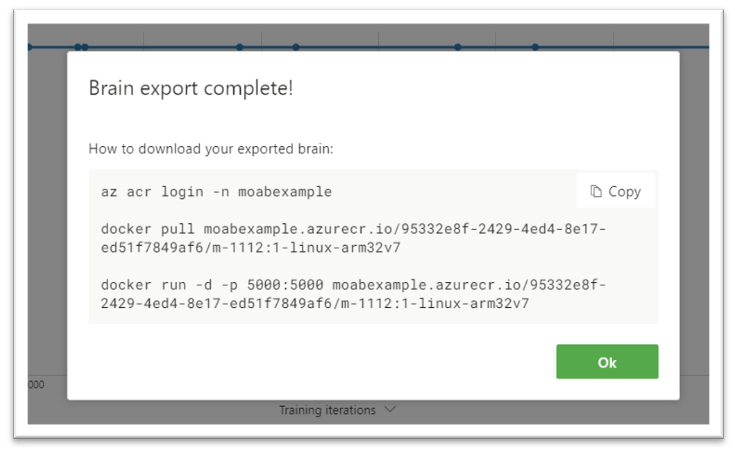
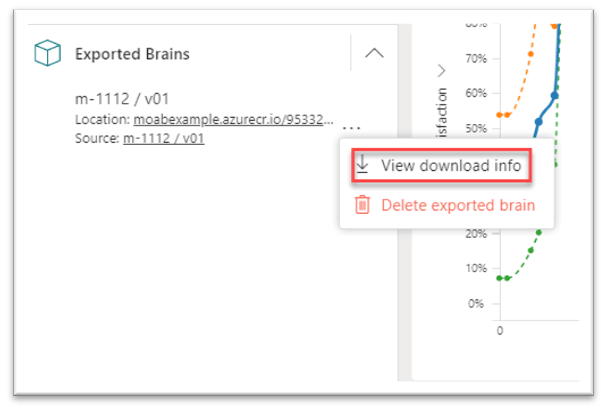
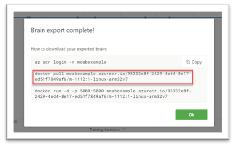
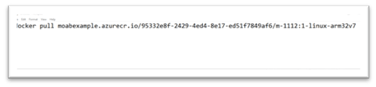

# Train and Export a Brain

## Train a brain

If you have not trained a brain already, please follow [Project Moab
tutorial](https://microsoft.github.io/moab/tutorials/) 1, 2 or 3 to
train a brain. 

**Prerequisites**: To complete the tutorials, you must have a Bonsai
workspace provisioned on Azure. If you do not have one, follow the
[account setup
guide](https://docs.microsoft.com/en-us/bonsai/guides/account-setup).

## Export a brain for deployment

1. In the Bonsai UI, Click on “**Export brain**” button in the Train tab
for your trained brain, as in the following screenshot:  

    

2. In the “**Export brain**” pop-up, under “**Processor architecture**”,
select “Linux” and “**ARM32V7**”, as in the following screenshot:  

    

3. Press the “**Export**” button, as in the following screenshot:

    

4. The brain version will appear in the **Exported Brains** list on the
left-hand side of the UI with an “**Exporting brain…**” status, as in
the following screenshot:

    

5. After your brain is exported, the “**Brain export complete!**” pop-up
will appear, as in the following screenshot:

    

    If the “**Export brain**” pop-up doesn’t appear after the export
    completes, click on the ellipsis (…) and click on “**View download
    info**” , as in the following screenshot:

    

    The “**Download exported brain**” pop-up will appear. It has the
    same download information.

6. Copy the **docker pull** command (middle line) from the exported
brain pop up, as in the following screenshot: 

    

7. Open your favorite text editor and copy/paste the **docker pull**
command.  

    

    You’ll use it to pull down your exported brain into your Moab during
    later steps.

