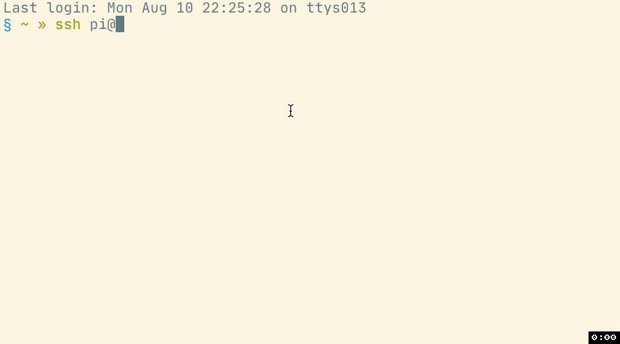

# Moab Guide

### Connect to your Moab

The easiest way to connect to your Moab is to use a LAN cable and connect it to
a router/switch. If this is not possible, you can connect to Wi-Fi as well, but
will need an HDMI cable and a USB keyboard to configure your wifi connection. 

#### Ethernet method

* If you have an available router/switch, connect the LAN cable to the Moab unit
  and then power it on. 

* From your PC (also connected to the same network), type `ping moab.local`

  You should see output like the following:

```
PING moab.local (XXX.XXX.XXX.XXX) 56(84) bytes of data.
64 bytes from moab.home (XXX.XXX.XXX.XXX): icmp_seq=1 ttl=64 time=0.218 ms
64 bytes from moab.home (XXX.XXX.XXX.XXX): icmp_seq=2 ttl=64 time=0.259 ms
64 bytes from moab.home (XXX.XXX.XXX.XXX): icmp_seq=3 ttl=64 time=0.259 ms
```

If you see this,

```
ping: moab.local: Name or service not known
```

then your moab is unreachable for some reason. Follow the HDMI method to
connect, instead. If you see an IP address, you can simple SSH onto it using

```
ssh pi@moab.local
```

#### HDMI method

* Connect the HDMI cable to the Moab unit and plug the other end into a monitor
* Connect a USB keyboard to Moab
* Power on the unit with the supplied 12V barrel adapter
* Once Raspbian has booted up, use the following default credentials to log on

  | Username | Password  |
  | -------- | --------- |
  | pi       | raspberry |

#### Finding out the IP address

To find out the IP address of your moab, type `hostname -I` at the command prompt

```
XXX.XXX.XXX.XXX 172.17.0.1 172.18.0.1
```

Usually, the first IP address is the IP address of your Moab (mostly of the form 192.168.X.XXX). You can use this to SSH onto it

```
ssh pi@XXX.XXX.XXX.XXX
```

#### Wi-Fi setup

If you want to configure Wi-Fi at this point, you will already need to be logged
onto the unit using either the LAN or HDMI methods. If not, please follow the
steps for those sections and then come back here.

- Now use `raspi-config` to connect to your WiFi network, and follow the steps in the GIF below to enter your SSID and passphrase for you Wi-Fi network.

  

  Use your WiFi router's administration page to look for a client called
  "moab" and use that IP address to SSH onto the device.

```
ssh pi@XXX.XXX.XXX.XXX
```

## Microsoft Open Source Code of Conduct

This project has adopted the [Microsoft Open Source Code of Conduct](https://opensource.microsoft.com/codeofconduct/).
For more information see the [Code of Conduct FAQ](https://opensource.microsoft.com/codeofconduct/faq/) or
contact [opencode@microsoft.com](mailto:opencode@microsoft.com)
with any additional questions or comments.

https://opensource.microsoft.com/codeofconduct

## Trademark Notice

Trademarks This project may contain trademarks or logos for projects,
products, or services. Authorized use of Microsoft trademarks or logos
is subject to and must follow Microsoft's Trademark & Brand Guidelines.
Use of Microsoft trademarks or logos in modified versions of this
project must not cause confusion or imply Microsoft sponsorship. Any use
of third-party trademarks or logos are subject to those third-party's
policies.

